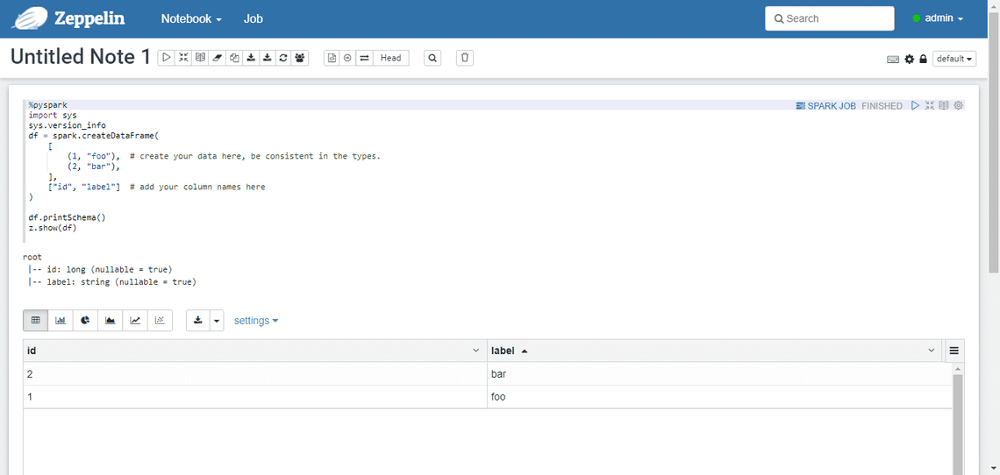
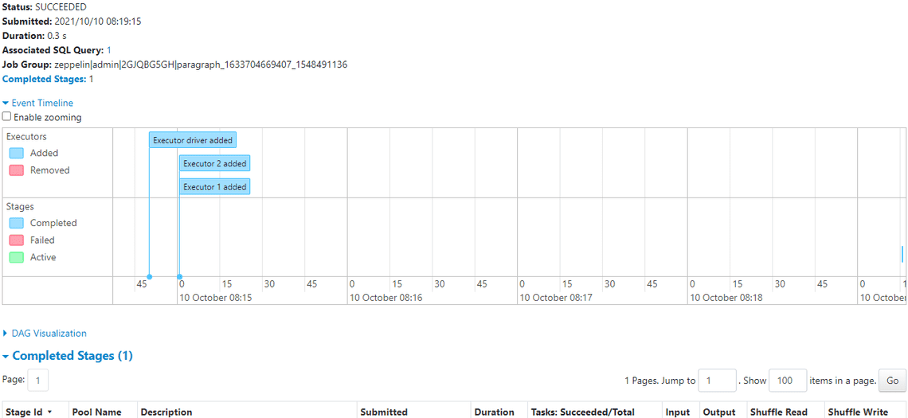
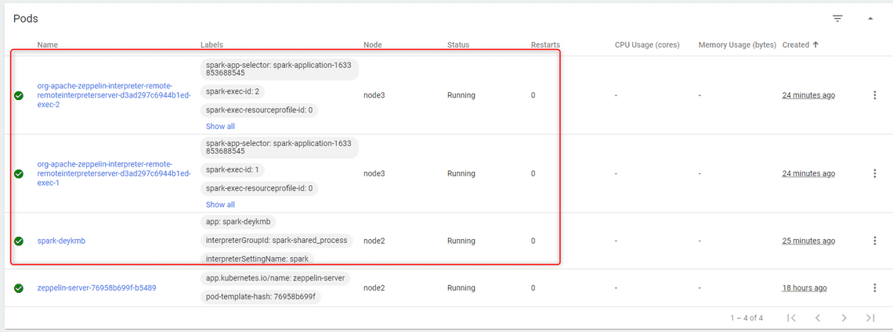

I'm using Zeppelin `0.10.0` (Python 3.7) and Spark `3.1.2` (with Python 3.7). 

## Apache Spark
- In **zeppelin-server.yaml** and **ingress.yaml** replace `zeppelin.yourdomain.com` to your domain
- In **clusterissuer.yaml** replace `yourname@email.com` to your email
- In **storage.yaml** replace `your-nfs-server-ip` to your NFS's IP. If you use other storage class, It's Ok, but make sure web have 3 PVC (**zeppelin-notebook-pvc**, **zeppelin-custom-k8s-pvc** and **zeppelin-server-conf-pvc**)

Create namespace

```powershell
kubectl create namespace spark
```

Create Storage
```powershell
kubectl apply -f storage.yaml
```

On **zeppelin-custom-k8s-pvc** (map to `/opt/zepplein/k8s` on cointainer) create folder **interpreter** then upload file **100-interpreter-spec.yaml** to that folder.

On **zeppelin-server-conf-pvc** (map to `/opt/zepplein/conf` on cointainer) upload file **shiro.ini**.

```ini
[users]
admin = youpassword, admin
# Sample LDAP configuration, for user Authentication, currently tested for single Realm

[main]
sessionManager = org.apache.shiro.web.session.mgt.DefaultWebSessionManager
### Enables 'HttpOnly' flag in Zeppelin cookies
cookie = org.apache.shiro.web.servlet.SimpleCookie
cookie.name = JSESSIONID
cookie.httpOnly = true
### Uncomment the below line only when Zeppelin is running over HTTPS
#cookie.secure = true
sessionManager.sessionIdCookie = $cookie
securityManager.sessionManager = $sessionManager
# 86,400,000 milliseconds = 24 hour
securityManager.sessionManager.globalSessionTimeout = 86400000
shiro.loginUrl = /api/login

[roles]
admin = *

[urls]
/api/version = anon
/api/cluster/address = anon
/api/interpreter/setting/restart/** = authc
/api/interpreter/** = authc, roles[admin]
/api/notebook-repositories/** = authc, roles[admin]
/api/configurations/** = authc, roles[admin]
/api/credential/** = authc, roles[admin]
/api/admin/** = authc, roles[admin]
#/** = anon
/** = authc
```

Deploy others resource

```powershell
kubectl apply -f zeppelin-server.yaml
kubectl apply -f ingress.yaml
kubectl apply -f clusterissuer.yaml
```

## Access to Zeppelin web UI

Create new config:
- `zeppelin.k8s.spark.useIngress`: type checkbox and ticked
- `zeppelin.k8s.interpreter.serviceAccount`: **zeppelin-server**
- `zeppelin.k8s.interpreter.container.imagePullPolicy`: **Always**
- `zeppelin.k8s.spark.container.imagePullPolicy`: **Always**

Edit config:
- `PYSPARK_PYTHON`: **python3**
- `PYSPARK_DRIVER_PYTHON`: **python3**

That's all!


## Demo

```python
%pyspark
import sys
sys.version_info
df = spark.createDataFrame(
    [
        (1, "foo"),  # create your data here, be consistent in the types.
        (2, "bar"),
    ],
    ["id", "label"]  # add your column names here
)

df.printSchema()
z.show(df)
```



